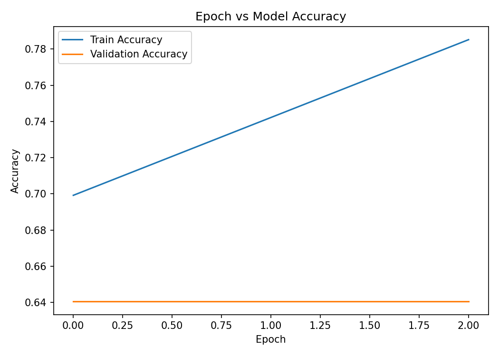
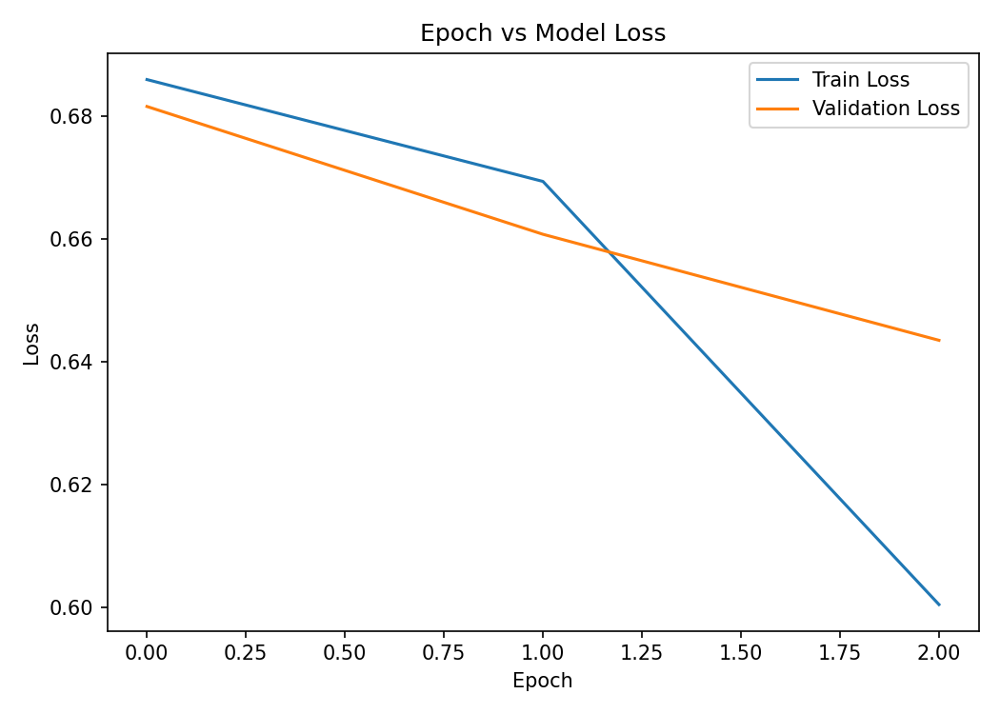
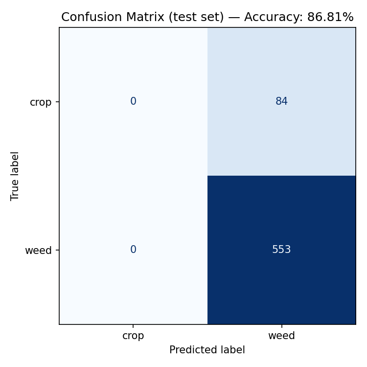

# 🌱 Crop vs Weed Detection — CNN for Precision Agriculture

[](https://www.python.org/)
[](https://www.tensorflow.org/)
[](LICENSE)
[](docs/paper_reference.md)

A CNN-based computer vision system that classifies field images as **crop** or
**weed**, enabling real-time, targeted decision-making for precision
agriculture (e.g. variable-rate herbicide spraying instead of blanket
application).

This is the open-source implementation companion to our published paper:

> **Efficient Crop vs Weed Detection in Precision Agriculture: A CNN Approach
> for Real-Time Decision Making** — *2024 3rd International Conference on
> Innovation in Technology (INOCON)*. See [`docs/paper_reference.md`](docs/paper_reference.md)
> for the full citation and paper-to-code mapping.

---

## ✨ Highlights

- **VGG16-based transfer learning CNN**, customized with a 2-layer
  classification head (256 → 128 → softmax) instead of VGG16's original 3,
  as described in the paper.
- **End-to-end pipeline**: raw YOLO-format bounding-box dataset →
  classification-ready image folders → training → evaluation → real-time
  inference.
- **Reported paper results**: 94.5% validation accuracy, 95% test accuracy.
- **Deployable**: real-time webcam inference script + an interactive
  Streamlit web demo.
- Clean, modular, documented source code — ready to extend, retrain, or drop
  into a portfolio / resume.

---

## 🧠 Architecture

```
Input (224×224×3 RGB)
        │
        ▼
 VGG16 convolutional base (13 conv layers, ImageNet-pretrained)
        │
        ▼
 GlobalAveragePooling2D
        │
        ▼
 Dense(256, ReLU) → Dropout(0.4)
        │
        ▼
 Dense(128, ReLU) → Dropout(0.3)
        │
        ▼
 Dense(2, Softmax)  →  [crop, weed]
```

- **Loss**: categorical cross-entropy
- **Optimizer**: Adam
- **Augmentation**: rotation, width/height shift, shear, zoom, horizontal
  flip, brightness jitter

See [`src/model.py`](src/model.py) for the exact Keras implementation.

---

## 📂 Project structure

```
crop-weed-detection-cnn/
├── src/
│   ├── data_preprocessing.py   # YOLO bboxes -> classification image folders
│   ├── model.py                 # VGG16-based CNN + a lightweight CNN variant
│   ├── train.py                 # training loop, augmentation, checkpoints, plots
│   ├── evaluate.py              # test-set metrics + confusion matrix
│   └── predict.py               # single-image / folder / webcam inference
├── app/
│   └── streamlit_app.py         # interactive browser demo
├── notebooks/
│   └── Crop_Weed_Detection_Training.ipynb   # Colab-ready end-to-end notebook
├── data/
│   └── README.md                # dataset download + preprocessing instructions
├── docs/
│   └── paper_reference.md       # paper summary + paper-to-code mapping
├── results/                     # generated training curves, confusion matrix
├── models/                      # generated model checkpoints
├── requirements.txt
└── LICENSE
```

---

## 🚀 Getting started

### 1. Clone & install

```bash
git clone https://github.com/<your-username>/crop-weed-detection-cnn.git
cd crop-weed-detection-cnn
pip install -r requirements.txt
```

### 2. Get the dataset

Download the **WeedCrop** dataset (Roboflow / Kaggle, YOLOv5 PyTorch export,
2,822 images, 2 classes: `crop`, `weed`) and place it under `data/raw/`. See
[`data/README.md`](data/README.md) for the exact expected layout.

> **Want to try it immediately without downloading anything?** This repo
> ships a small tracked sample dataset at `data/sample/` (already
> preprocessed into classification folders) plus a demo checkpoint at
> `models/best_model.keras`, so you can jump straight to steps 5–7 below.

### 3. Preprocess (bounding boxes → classification crops)

```bash
python src/data_preprocessing.py \
    --source data/raw/WeedCrop.v1i.yolov5pytorch \
    --output data/processed
```

### 4. Train

```bash
python src/train.py --data data/processed --epochs 25 --batch-size 32
```

Optional fine-tuning pass (unfreezes the later VGG16 blocks):

```bash
python src/train.py --data data/processed --epochs 10 --lr 1e-5 --fine-tune-at 15
```

> No internet access to download ImageNet weights? Use
> `--lightweight` to train the small from-scratch CNN in `src/model.py`
> instead — useful for a quick smoke test of the whole pipeline.

### 5. Evaluate

```bash
python src/evaluate.py --model models/best_model.keras --data data/processed --split test
```

### 6. Run inference

```bash
# Single image
python src/predict.py --model models/best_model.keras --image path/to/image.jpg

# Real-time webcam
python src/predict.py --model models/best_model.keras --webcam
```

### 7. Launch the web demo

```bash
streamlit run app/streamlit_app.py
```

---

## 📊 Results

**As reported in the paper** (full dataset, VGG16 transfer learning, 25
epochs):

| Metric | Value |
|---|---|
| Validation accuracy | 94.5% |
| Test accuracy | 95% |

**Pipeline verification run** (small subset, lightweight CNN, a handful of
epochs, checked into `results/` as a working demonstration of the full
code path):





To reproduce numbers close to the paper, train the full `build_model()`
(VGG16 transfer learning) on the complete dataset — see
[`results/README.md`](results/README.md) for details.

---

## 🛠️ Tech stack

`Python` · `TensorFlow / Keras` · `OpenCV` · `scikit-learn` · `Streamlit` ·
`NumPy` · `Matplotlib`

---

## 📄 Citation

If you use this code, please cite the paper:

```bibtex
@inproceedings{cropweed2024inocon,
  title     = {Efficient Crop vs Weed Detection in Precision Agriculture: A CNN Approach for Real-Time Decision Making},
  author    = {Nayana M K and Khushi R M and Satish Chikkamath and Pragnya S A},
  booktitle = {2024 3rd International Conference on Innovation in Technology (INOCON)},
  year      = {2024}
}
```

## 📜 License

This project is released under the [MIT License](LICENSE).
